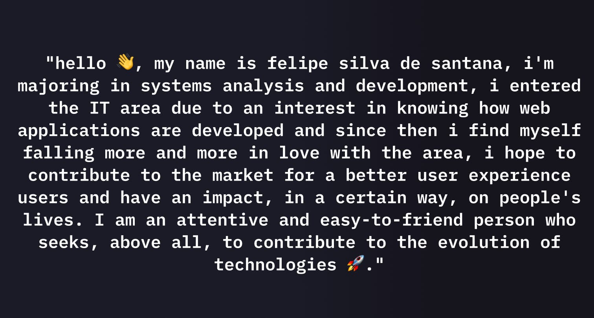

##

        
   

##

 

  

 

##

##

<table align="right" height="500px" >
   <tr >
<td align="center" >
  
   
    <pre align="center">HTML</pre>   
   
</td>

<td align="center" >

       
    <pre align="center">CSS3</pre>   
   
</td>

<td align="center" >
 
       
    <pre align="center">JAVASCRIPT</pre>   
   
</td>
 </tr>

 <tr>

<td align="center" >
    
       
    <pre align="center">REACT</pre>   
   
   </td>
       <td align="center" >
          
            
    <pre align="center">STYLED COMPONENTS</pre>   
   
      </td>

   <td align="center" >
 
       
    <pre align="center">NODE JS</pre>   
   
</td>
   </tr>

 <tr  >
 
     
   <td align="center" >
          
            
    <pre align="center">TYPESCRIPT</pre>   
   
      </td>
    <td align="center" >
          
            
    <pre align="center">SASS</pre>   
   
      </td>

 <td align="center" >
          
            
    <pre align="center">FIGMA</pre>   
   
      </td>
   </tr>

 <tr >
   <td align="center" >
          
            
    <pre align="center">GITHUB</pre>   
   
      </td>
      <td align="center" >
          
            
    <pre align="center">GIT</pre>   
   
      </td>

   <td align="center" >
          
            
    <pre align="center">VITE</pre>   
   
      </td>
   </tr>
 <tr >

<td align="center" >
          
               
    <pre align="center">TAILWIND CSS</pre>   
   
      </td>

 <td align="center" >
          
               
    <pre align="center">NPM</pre>   
   
      </td>
       <td align="center">
          
            
    <pre align="center">BOOTSTRAP</pre>   
   
      </td> 
 </tr>

 <tr >
   <td align="center">
          
            
    <pre align="center">VSCODE</pre>   
   
      </td>
   </tr>
  
</table>

##

   

 

 
 
   
##
